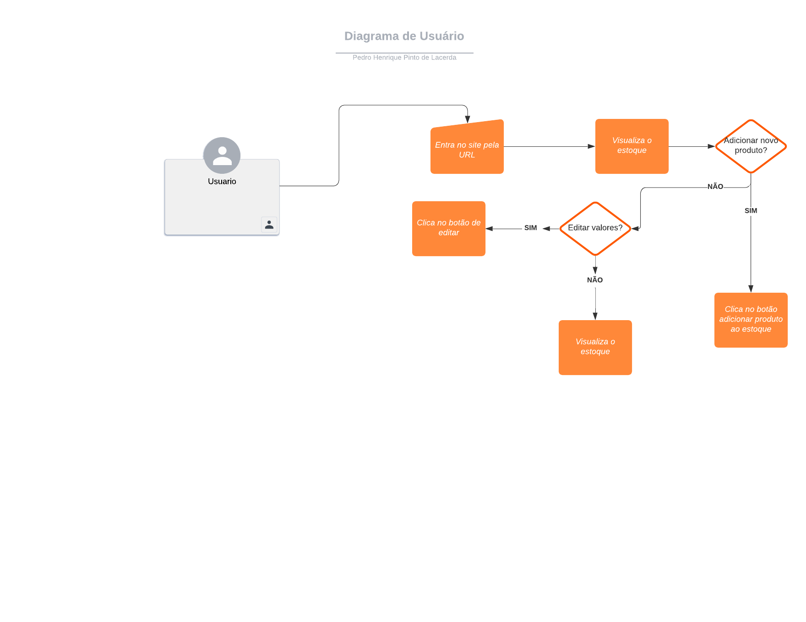

# Projeto de Interface

Dentre as preocupações para a montagem da interface do sistema, estamos estabelecendo foco em questões como agilidade, acessibilidade e usabilidade. Desta forma, o projeto tem uma identidade visual padronizada em todas as telas que são projetadas para funcionamento em desktops e dispositivos móveis.
## Diagrama de Fluxo

O diagrama apresenta o estudo do fluxo de interação do usuário com o sistema interativo e  muitas vezes sem a necessidade do desenho do design das telas da interface. Isso permite que o design das interações seja bem planejado e gere impacto na qualidade no design do wireframe interativo que será desenvolvido logo em seguida. O diagrama  do projeto a ser desenvolvido mostra a necessidade de um login para em seguida acessar um dashboard interativo, onde será permitido fazer cadastro e baixa de produtos, acompanhar os indicadores como  vendas, estoque e ainda mais. Através da tela inicial, é possível acessar o menu, que contará com estoque, relatórios, financeiro e pesquisas.

Veja o exemplo de estrutura básica de um diagrama de fluxo centrado nas ações dos usuários:

## Wireframes

